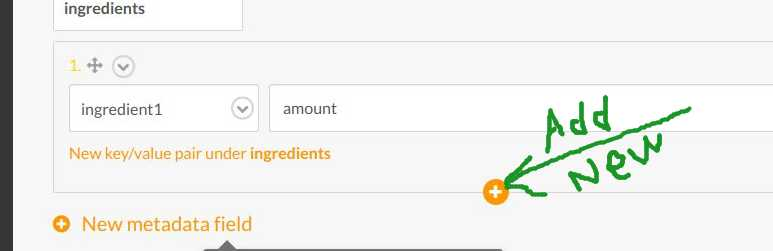

# ipCook
[Check recipes](https://ip-cook.herokuapp.com/)

Project is powered by Jekyll and Gulp steroids. 
Before project is build Gulp tasks are executed to resize images, minify and uglify ```.css``` and ```.js```.
Application watches local changes in ```_post``` and ```_assets/images```, automatically commit to and push to git repo, makes production build and deploy it to heroku. All other changes require manual commits and production build.

## Getting started
### Prerequisites
You need npm to be installed globally

Install [Jekyll](https://jekyllrb.com/docs/installation/)

### Install 
Install dependencies: 
```
npm install
```
### Start local 
Start local development server execute:
```
gulp serve
```
Now local version is available on http://localhost:4000/

Post add/edit features are available on main application window or with any markdown text editor in ```_posts/``` folder.

To add or update images:
 1. place new file into ```_assets/images/```.
 2. Update ```src``` field in correspondent post front-matter through local admin page or directly in ```_posts/**.md```
 
 
### Build static web resource
```
gulp build:prod
```
### Write new or edit recipe 
For new recipes recommended file name (or **path** when using Jekyll admin) pattern is: ```YYYY-DD-MM-some-title.md```
#### General pattern (if using text editor)
Fields *title, layout, output, permalink, src, origin, category, tags, ingredients, date* are part of Front Matter data. It have required srtict formatting to avoid display mistakes. See below.
Cooking instructions are actually post text and doesn't require special formatting. 

Please check Jekyll docs for correct way to [style  YAML Front Matter](https://jekyllrb.com/docs/frontmatter/)  
and [basic post pattern](https://jekyllrb.com/docs/posts/#a-typical-post)

#### Front matter required fields descriptions, patterns and default values

title: any title you want

layout: **post** - defualt value, don't change it 

output: **true** - default value, don't change it

permalink: ```"/any-title-you-want/"``` - required pattern

src: ```"/assets/images/**.jpg"``` - required pattern. Live it empty if you don't have image
 
origin: put here link to external recipe resource (optional)
 
category: **desserts**, **appetizers**, **main** - type only one of them

tags: *currently are not supported* - live empty

ingredients: check below

date: 'YYYY-MM-DD HH:MM:SS +0000'

#### Ingredients
When adding through text editor For correct display make sure you use ":" between ingredient and amount and *one white space* between amount and units

Basic example with common user cases:
```
ingredients:
- some product: 400 g
- prodA (or  prodB): 1 pcs(0.5tbsp)
- some prod: ''
```

When using Jekyll Admin follow same rules, except instead ```''``` leave the field empty.

Add new ingredient field as shown:
 


and select "Convert to Object"

## Git commit
Note: when changed project sources (not posts or images) before commit make sure ```_site``` folder contains full static version, including all HTML pages. If not [Build static web resource](#build-static-web-resource) before.

## Build with:
- Jekyll
- Gulp

## Author
Iuliia Pishchulina